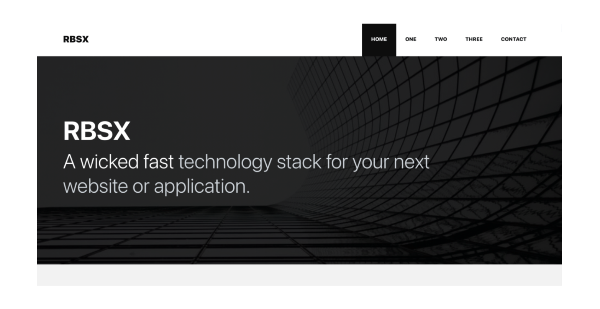

# RBSX

<a href="https://moquette.github.io/react-tailwindcss/" rel="React Tailwindcss"></a>

A wicked fast technology stack for your next website or application.

 
[](LICENSE)

<a href="https://github.com/moquette/rbsx" alt="Code Page"></a>

<a href="https://rbsx.moquette.us" alt="Demo Page"></a>

## Clone repo:

```bash
https://github.com/moquette/rbsx.git
```

## Installation

```bash
yarn install
```

## Development Server

```bash
yarn start
```

## Production build

```bash
yarn build
```
